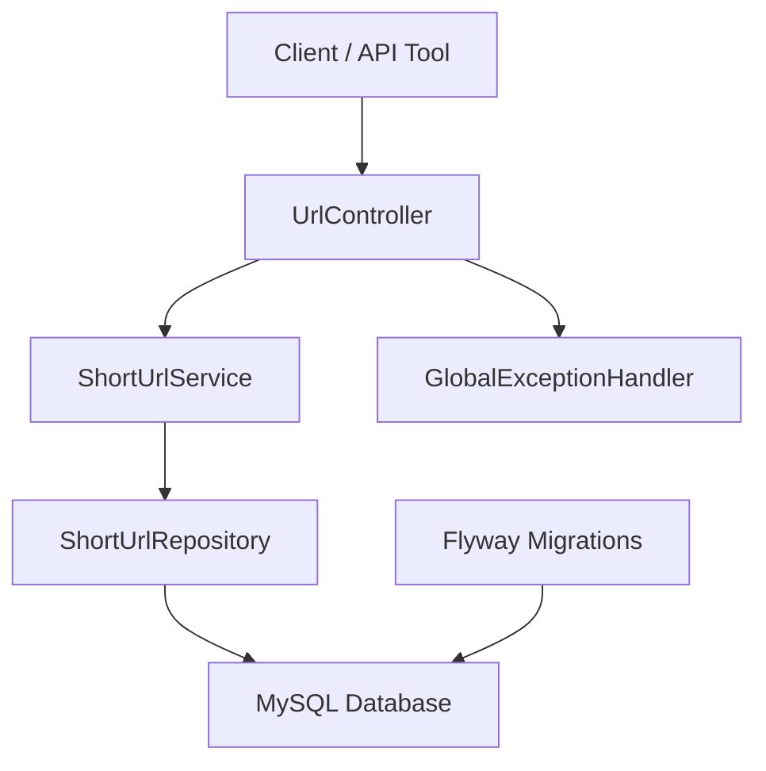

# URL Shortener

A backend URL Shortener built with Spring Boot, Spring Data JPA, MySQL, and Flyway. The service creates compact short links, redirects users to the original URL, tracks click counts, supports custom aliases, and can expire links after a configured number of days.

## Project Overview

This project demonstrates a clean REST API backed by persistent storage and database migrations. It is structured around a simple controller-service-repository flow, with DTO validation, centralized exception handling, environment-specific configuration, and H2-backed automated tests.

## Features

- Generate short URLs for long HTTP/HTTPS links
- Redirect short URLs to original URLs
- Create custom aliases
- Track redirect click counts
- View URL metadata
- Delete short URLs
- Optional link expiration using TTL days
- MySQL persistence with Flyway-managed schema
- H2-based test profile for local test execution

## Architecture Diagram



## Database Schema Summary

Main table: `short_urls`

| Column | Purpose |
| --- | --- |
| `id` | Primary key |
| `long_url` | Original destination URL |
| `short_code` | Unique generated code or custom alias |
| `created_at` | Creation timestamp |
| `expires_at` | Optional expiration timestamp |
| `click_count` | Number of successful redirects |
| `created_by` | Optional owner field for future user support |

The `short_code` column is unique and indexed for fast lookups during redirects.

## Flyway Migration Workflow

Flyway manages database schema creation and versioning.

- Migration files live in `src/main/resources/db/migration`
- The initial schema is defined in `V1__create_short_urls_table.sql`
- Application startup runs pending migrations before JPA validation
- JPA uses `ddl-auto=validate`, so production does not rely on automatic schema creation

For future schema changes, add a new migration such as:

```text
V2__add_new_column.sql
```

## Local Development Setup

Requirements:

- Java 17
- Maven wrapper included
- MySQL running locally

Create the local database:

```sql
CREATE DATABASE url_shortener;
```

Update `src/main/resources/application-dev.properties` with your local MySQL credentials if needed.

Run the application:

```bash
./mvnw spring-boot:run
```

On Windows:

```bash
mvnw.cmd spring-boot:run
```

The default development base URL is:

```text
http://localhost:8080
```

## Environment Variables

The production profile reads configuration from environment variables:

| Variable | Purpose |
| --- | --- |
| `SERVER_PORT` | Server port, defaults to `8080` |
| `DATABASE_URL` | JDBC database URL |
| `DATABASE_USERNAME` | Database username |
| `DATABASE_PASSWORD` | Database password |
| `APP_BASE_URL` | Public base URL used when returning short links |

Run with the production profile:

```bash
mvnw.cmd spring-boot:run -Dspring-boot.run.profiles=prod
```

## Running Tests

Tests use the `test` profile and an in-memory H2 database, so MySQL is not required.

```bash
mvnw.cmd test
```

The test suite covers:

- URL creation
- Custom alias creation
- Alias collision handling
- Redirect and click count behavior
- Expired URL behavior
- Delete behavior
- Validation failures
- Flyway migration execution

## API Examples

### Create Short URL

```http
POST /api/shorten
Content-Type: application/json
```

```json
{
  "longUrl": "https://www.youtube.com"
}
```

Example response:

```json
{
  "shortUrl": "http://localhost:8080/rqEDAfp",
  "shortCode": "rqEDAfp"
}
```

### Create Short URL With Custom Alias

```json
{
  "longUrl": "https://www.example.com/profile",
  "customAlias": "my-profile"
}
```

### Create Expiring Short URL

```json
{
  "longUrl": "https://www.example.com/campaign",
  "ttlDays": 7
}
```

### Redirect

```http
GET /{shortCode}
```

Example:

```text
http://localhost:8080/rqEDAfp
```

### Get URL Info

```http
GET /api/info/{shortCode}
```

Example response:

```json
{
  "longUrl": "https://www.youtube.com",
  "shortCode": "rqEDAfp",
  "clickCount": 5,
  "createdAt": "2025-12-09T14:22:01",
  "expiresAt": null
}
```

### Delete Short URL

```http
DELETE /api/{shortCode}
```

Returns `204 No Content` when deletion succeeds.

## Future Improvements

- Add authentication and user-owned links
- Add rate limiting and abuse protection
- Add Redis caching for redirect lookups
- Move analytics tracking to an async pipeline
- Add richer analytics such as referrer, browser, and location
- Add Docker and deployment configuration
- Add CI/CD workflow
- Add production monitoring and structured logging

